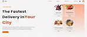

> Fullstack Food Delivery Application using Reactjs
> [Follow US](https://www.instagram.com/kishan0610/)



# To check the node version
```
node --version
```

# To initialise the firebase console
```
firebase init
```

# To start the server
```
npm run server
```

# To create new react project using npm & yarn
```
npm create-react-app folder_name 
yarn create react-app folder_name 
```

# To start the client
```
yarn start
```

> Packages used

<!-- pritier-ignore -->
| Name              | Links |
|-------------------|-------|
| Reactjs           | [React](https://reactjs.org/) |
| Tailwind CSS      | [TailwindCSS](https://tailwindcss.com/) |
| Firebase functions| [Functions](https://firebase.google.comd/docs/functions)|
| Express           | [Express](https://expressjs.com)|
| React Router DOM  | [ReactRouterDOM](https://reactrouter.com/en/main)|
| Framer Motion     | [FramerMotion](https://www.framer.com/motion/)|
| React Icons       | [ReactIcons](https://www.react-icons.github.io/react-icons/)|
